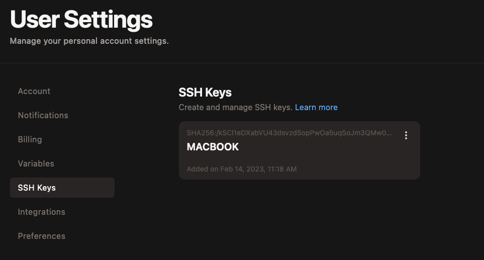
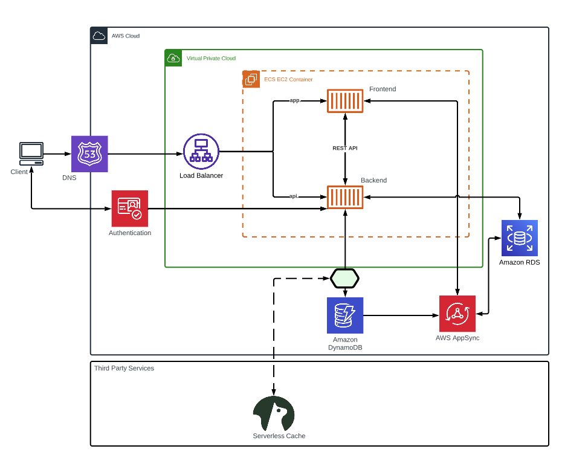

# Week 0 — Billing and Architecture

## Add SSH keys to GITPOD to open the VSCode Desktop without password
Generated SSH keys and add the keys to the gitpod config to open the desktop VSCode without a prompt for password. Make sure to save the private key at ~/.ssh/id_ed25519. The copy the contents of the public key - id_ed25519.pub into the ssh keys under user settings https://gitpod.io/user/keys
```
ssh-keygen -t ed25519
```


### Create a new User and Generate AWS Credentials

(IAM Users Console](https://us-east-1.console.aws.amazon.com/iamv2/home?region=us-east-1#/users)

- Create an IAM user - IAMADMIN
- Enable Console access for the user
- Create a new Admin group and apply `AdminstratorAccess`
- Create Access key
- Download the access key CSV

## AWS CLI Installation

Modification to gitpod.yaml to include scripts to run the first time the workspace is established. This includes installing AWS cli and setting up the environment variable to get prompts for aws cli completion.

Update the `.gitpod.yml` with the following task defition.
```sh
tasks:
  - name: aws-cli
    env:
      AWS_CLI_AUTO_PROMPT: on-partial
    init: |
      cd /workspace
      curl "https://awscli.amazonaws.com/awscli-exe-linux-x86_64.zip" -o "awscliv2.zip"
      unzip awscliv2.zip
      sudo ./aws/install
      cd $THEIA_WORKSPACE_ROOT
```

Also added environment variables that are needed in the GITPOD 
```
export AWS_ACCESS_KEY_ID=""
export AWS_SECRET_ACCESS_KEY=""
export AWS_DEFAULT_REGION=us-east-1
export AWS_REGION=us-east-1
```

Setting the AWS_DEFAULT_REGION alone is not sufficient. Without setting the AWS_REGION following error was seen.
```sh
aws cloudwatch put-metric-alarm --cli-input-json file://aws/json/alarm-config.json

An error occurred (ValidationError) when calling the PutMetricAlarm operation: Invalid region <REGION> specified. Only us-east-1 is supported.
```

Save these environment variable into Gitpod for future workspaces
```
gp env AWS_ACCESS_KEY_ID=""
gp env AWS_SECRET_ACCESS_KEY=""
gp env AWS_DEFAULT_REGION=us-east-1
gp env AWS_REGION=us-east-1
```

### Validate the AWS CLI by checking for user's identity
```sh
aws sts get-caller-identity
```

```json
{
    "UserId": "AIDA6CN2EUFZ5GG2TBZ3X",
    "Account": "967294886259",
    "Arn": "arn:aws:iam::967294886259:user/iamadmin"
}
```

## Billing Setup
Billing alerts will notify the user if the AWS usage cost rises above a certain threshold.

### Enable the Billing alert
To enable it -> Goto AWS Billing page and enable `Receive Billing Alerts` under `Billing Perferences`

### Create a SNS Topic

SNS topic needs to be first created and then associated with an alarm. It provides the mechanism to deliver the alert when a set threshold of cost is hit.
[aws sns create-topic](https://docs.aws.amazon.com/cli/latest/reference/sns/create-topic.html)

```sh
aws sns create-topic --name billing-alarm
```
The above command will return a SNS topic ARN.
```sh
aws sns list-topics
{
    "Topics": [
        {
            "TopicArn": "arn:aws:sns:us-east-1:967294886259:billing-alarm"
        }
    ]
}
```

Create a SNS subscription and associate the above ARN and the email where you want the alert.
```sh
aws sns subscribe \
    --topic-arn arn:aws:sns:us-east-1:967294886259:billing-alarm \
    --protocol email \
    --notification-endpoint bxxxxxxxxxxxx@gmail.com
```

An email will be sent for confirmation. Clicking the link will confirm the subscription.

#### Create the Cloudwatch Alarm
- [aws cloudwatch put-metric-alarm](https://docs.aws.amazon.com/cli/latest/reference/cloudwatch/put-metric-alarm.html)
- [Create an Alarm via AWS CLI](https://aws.amazon.com/premiumsupport/knowledge-center/cloudwatch-estimatedcharges-alarm/)
- [Alarm-Config](aws/json/alarm-config.json)
```sh
aws cloudwatch put-metric-alarm --cli-input-json file://aws/json/alarm_config.json
```
 
 ## Create an AWS Budget

[aws budgets create-budget](https://docs.aws.amazon.com/cli/latest/reference/budgets/create-budget.html)

Run AWS Cli to extract the AWS Account ID
```sh
aws sts get-caller-identity --query Account --output text
```

- In the below command use the accoint ID from the previous command output
- Update the json files with threshold and email address
- [Budget-Config](../aws/json/budget.json)
- [Budget-Notification-with-Subscriber](../aws/json/budget-notifications-with-subscribers.json)

```sh
aws budgets create-budget \
    --account-id AccountID \
    --budget file://aws/json/budget.json \
    --notifications-with-subscribers file://aws/json/budget-notifications-with-subscribers.json
```


## Conceptual Cruddur Diagram


## Lucid Cruddur Logical Diagram

Here is the link to the [logical diagram](https://lucid.app/lucidchart/bb8ce4de-0bdd-4b22-9486-7b2c93a8e17c/edit?viewport_loc=-2510%2C-172%2C2400%2C2026%2C0_0&invitationId=inv_3ecb8cd9-52f3-439a-a047-9b7bdc34f40d)
